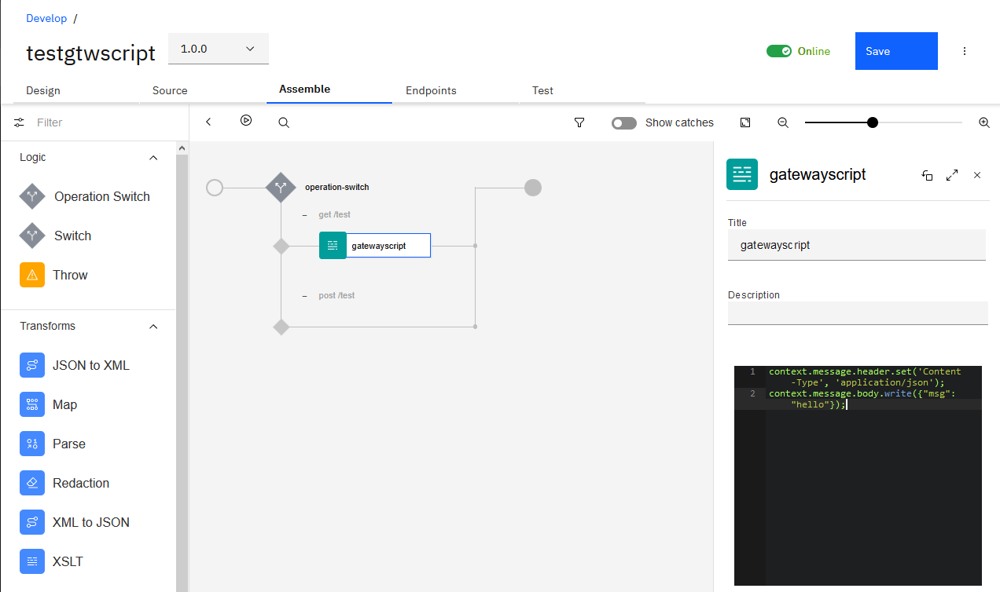

IBM API Connect Sample Gateway scripts
In this article we provide simple sample of gateway script useful for IBM API Connect

# Introduction
Two programing languages: XSLT and GatewayScript

## Why coding?

Useful links to official documentation:
[Using context variables in GatewayScript and XSLT policies with the DataPower API Gateway](https://www.ibm.com/support/knowledgecenter/SSMNED_v10/com.ibm.apic.toolkit.doc/rapic_apigw_apis_gws_xslt.html)

[API Connect context variables](https://www.ibm.com/support/knowledgecenter/SSMNED_v10/com.ibm.apic.toolkit.doc/rapim_context_var.html)

[OAuth context variables](https://www.ibm.com/support/knowledgecenter/SSMNED_v10/com.ibm.apic.toolkit.doc/rapic_oauth_context_vars.html)

## Guidelines
### Don't
Use carefully the different tools such as Existing policies, Global Policies, User Defined Policies, and code within an API.
Another aspect is do I need to use a piece of code or default policies

### Do

# Useful tips
### Automation

## Returns a simple JSON message in the response
```
context.message.header.set('Content-Type', 'application/json');
context.message.body.write({"msg": "hello"});
```


## Manipulate parameters
As described in the documentation (see links at the beginning of this article). Parameters are described with 2 information: the locations and the values. In the assembly you get access to the parameters using the context.request.parameters object.
This gives you a structure containing arrays for both the locations and values. (This is normal and follows HTTP specifications).
Let's take a simple sample, an operation with GET HTTP verb that has 2 query parameters *name_to_return* and *param2*.
The object (for more clarity, not represented as JSON here but instead extracted from the step by step debugger) give this:
```
parameters: Object
	name_to_return: Object
		locations: Array(1)
			0: "query"
		values: Array(1)
				0: "Foo"
	param2: Object
		locations: Array(1)
			0: "query"
		values: Array(1)
			0: "Value2"
```

So to get access to the value of the name_to_return parameter (assuming only one parameter with this name), I simply use the following code:
```
var namet = context.request.parameters.name_to_return.values[0];
```
I can get access to the locations of this parameter (assuming only one parameter with this name)
```
var namel = context.request.parameters.name_to_return.locations[0];
```

## Manipulate JSON structure
* First line create a string
* Second line create a JSON object
* Third line, append the JSON object

```
var fmsg= "hello " + namet;
var rt= {"msg": fmsg};
rt.msg2 = "msg2_value";
```

## Manipulate headers
### Add a custom header for the response
context.message.header.set('my-header1', 'my-h1-value');

### Propagate Authorization header
```
var au = context.request.header.get('Authorization');
context.message.header.set('Authorization', au));
```

## Write a message to the console
```
var all_apis = context.get('api');
console.error('>>> all_apis: ' + JSON.stringify(all_apis));
```

## Manipulate context Variable          
```
var clientID = context.get('client.app.id');
context.message.header.set('mycid', clientID);
```

## Perform URI mapping
In this sample we specify a small piece of code where we remove the base path in order to invoke the backend API.
There is small gateway script to specify the new path based on the request.path

```
var rpath = context.get('request.path');
var bpath = context.get('api.root');
var dest_path = rpath.substr(bpath.length + 1);
context.set('dest_path', dest_path);
```

In the invoke you can use this variable like this:
`$(target-url)$(dest_path)`
